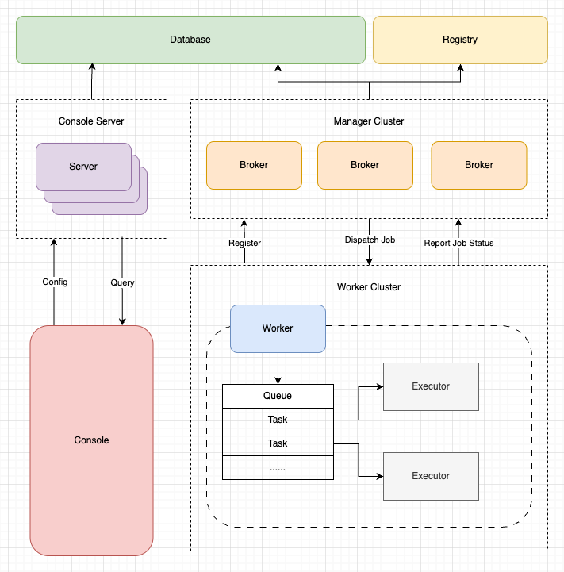

# 简介

**Fluxion**主要用于搭建统一的任务调度平台，方便各个业务方进行接入使用。 项目在设计的时候，考虑了扩展性、稳定性、伸缩性等相关问题，可以作为公司的任务调度中间件被使用。

## 功能介绍

<div align="center">

</div>

**Fluxion**主要分为以下几个部分：

* Broker：管控节点，对配置好的任务在集群进行负载，同时管理和维护节点注册等。
* Worker：工作节点，主要负责Task的具体执行。
* Console：通过Broker提供的Api，进行任务创建/更新等一些管控操作。
* Datasource：数据库用于持久化运行数据

### 调度类型

* 固定速度：作业创建后，每次调度下发后，间隔固定时间长度后，再次触发作业调度。
* 固定延迟：作业创建后，每次作业下发执行完成（成功或失败）后，间隔固定时间长度后，再次触发作业调度。
* CRON：通过CRON表达式指定作业触发调度的时间点。

### 负载策略

* 随机：将作业随机下发给某一个节点执行。
* 轮询：将任务逐个分配给节点。
* 最不经常使用：将作业下发给一个时间窗口内，接收作业最少的节点。
* 最近最少使用：将作业下发给一个时间窗口内，最长时间没有接受工作的节点。
* 一致性hash：同样参数的作业将始终下发给同一节点。
* 指定节点：让作业指定下发到某个节点执行。

### 节点过滤方式

1. 执行器：任务只会下发给包含任务对应执行器的节点。
2. 标签：任务只会下发给包含指定标签的节点。
3. 容量：基于节点的任务队列/CPU/内存使用情况过滤。

### 任务触发方式

* 调度：Broker自动组装数据，调度对应的任务。

### 执行类型

* 执行器：执行的时候只创建一个Job实例
* 工作流：DAG视图，可以串联Job，基于视图可能存在多个Job实例

### 任务类型

* 普通：对应某个执行器，执行结束任务结束。
* 广播：在下发的时间点，对每个可下发的节点下发任务，所以子任务执行完成当前任务才执行完成。

各种任务的具体使用可以参考：[Demo](https://github.com/limbo-io/fluxion/tree/master/fluxion-worker/fluxion-worker-demo/src/main/java/io/fluxion/worker/demo/executor)

# 使用帮助

## Server部署

### 环境要求

- JDK8
- Mysql

### Step1: 数据库配置

目前使用`flywaydb`动态地进行数据初始化操作

| 配置项                | 说明   |
|--------------------|------|
| spring.datasource.url | 连接地址 |
| spring.datasource.username | 账号   |
| spring.datasource.password | 密码   |

### Step2: 服务打包

根据需要修改配置

| 配置项                                     | 说明                                                                             |
|-----------------------------------------|--------------------------------------------------------------------------------|
| fluxion.broker.host                     | 提供给worker的服务的 host。可以是域名或 IP 地址，如不填写则自动发现本机非 127.0.0.1 的地址。多网卡场景下，建议显式配置 host。 |
| fluxion.broker.port                     | 提供给worker的服务 port 默认 9785，                                                     |
| fluxion.broker.protocol                 | RPC 通信协议类型。默认为 http                                                            |

项目根目录下，执行如下命令打包编译，通过`-P`参数指定环境，如开发环境为`-P dev`

```
mvn clean package -Dmaven.test.skip=true -Pdev
```

## Worker部署

对于需要使用worker的Web应用（宿主应用），可以参考[Demo](https://github.com/limbo-io/fluxion/tree/master/fluxion-worker/fluxion-worker-demo)。


### Step1: 添加依赖

对于`Maven`项目

```
<dependency>
    <groupId>io.github.limbo-io</groupId>
    <artifactId>fluxion-worker-spring-boot-starter</artifactId>
    <version>x.x.x</version>
</dependency>
```

### Step2: 修改配置

#### Worker配置

| 配置项                      | 说明                                                                   |
|--------------------------|----------------------------------------------------------------------|
| fluxion.worker.appName   | 应用名，如果不输入默认使用spring应用名                                               |
| fluxion.worker.protocol  | RPC 通信协议类型。默认为 http。                                      |
| fluxion.worker.host      | RPC host。可以是域名或 IP 地址，如不填写则自动发现本机非 127.0.0.1 的地址。多网卡场景下，建议显式配置 host。 |
| fluxion.worker.port      | RPC port 如果未指定此配置，默认 9787                                            |
| fluxion.worker.brokers   | Broker节点地址，可配置多个，参考DEMO中的配置                                          |
| fluxion.worker.heartbeat | Worker 向 Broker 发送心跳请求的间隔，默认 2 秒。                                    |
| fluxion.worker.tags      | 标签，k=v形式                                                             |


# 前端应用

结合Console接口，提供了对应的官方前端项目：[点击跳转](https://github.com/limbo-io/fluxion-console)

# 参与贡献

如果你对本项目有任何建议或想加入我们的，可以通过下面方式：

- 报告 issue: [github issues](https://github.com/limbo-io/fluxion/issues)
- 提交PR：[github PR](https://github.com/limbo-io/fluxion/pulls)
- 加入我们：ysodevilo@163.com
